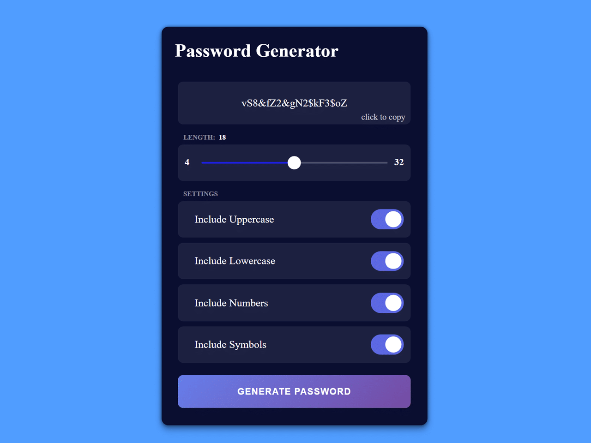

## چالش شماره ۲ - رمزساز

### زبان‌ها و کتابخانه‌های قابل قبول
HTML, CSS, JS

### قوانین چالش
- اجباری در پیاده‌سازی دقیق رابط کاربری (UI) پروژه نیست. می‌توانید صرفا با تگ‌های HTML، و بدون CSS ظاهر رو پیاده کنید و روی منطق و JavaScript چالش تمرکز کنید.
- با زدن روی فیلد اول باید رمز عبور ساخته شده کپی شود.
- اسلایدر باید بین ۱ تا ۳۲ قابلیت تغییر داشته باشد و با تغییر مقدار اسلایدر عدد سمت چپ اسلاید به صورت پویا باید تغییر کند. برای مثال مقدار اسلایدر اگر ۵ شد باید عدد سمت چپ هم ۵ شود.
- گزینه Uppercase اگر فعال باشد، باید در رمز عبور از حروف بزرگ استفاده شود.
- گزینه Lowercase اگر فعال باشد، باید در رمز عبور از حروف کوچک استفاده شود.
- گزینه Numbers اگر فعال باشد، باید در رمز عبور از عدد استفاده شود.
- گزینه Symbols اگر فعال باشد، باید در رمز عبور از نشانه‌هایی مانند @ # $ استفاده شود.
- اگر کاربر بر روی دکمه Generate Password کلیک کرد باید رمز عبور ایجاد شود و در فیلد اول نمایش داده شود.

### چگونه در چالش شرکت کنم؟
1. اگر با گیتهاب و گیت آشنا نیستید [این ویدئو](http://youtu.be/xDdal3QSypE) رو ببینید.
2. قوانین چالش رو با دقت مطالعه کنید و کد پروژه رو بنویسید.
3. کد پروژه رو در سایت [CodePen.io](https://codepen.io/) منتشر کنید.
4. اگر با Pull Request آشنا نیستید [این ویدئو](https://youtu.be/CML6vfKjQss?t=106) یا [این ویدئو](https://www.youtube.com/watch?v=HbSjyU2vf6Y&pp=ygURY29udHJpYnV0ZSBnaXRodWI%3D) رو ببینید. اگر مشکل داشتید به آیدی [ItsTarv@](https://t.me/ItsTarv) پیام بدید.
5. این ریپو رو Fork کنید به فایل participants.js برید و نام، آیدی گیتهاب و لینک کد پِن رو به اون اضافه کنید.
6. پول ریکوئست رو ثبت کنید و منتظر تایید باشید. پس از تایید کد شما در جدول همین فایل نمایش داده می‌شود.

### کانال تلگرام
[@CodePeykar](https://t.me/CodePeykar)
### گروه تلگرام
برای عضویت در گروه تلگرام باید حداقل یک چالش رو انجام بدید و به آیدی زیر پیام بدید.

[@ItsTarv](https://t.me/ItsTarv)

### انجام‌دهندگان چالش

| Github Username | CodePen Source & Preview | UI  |
| --------------- | ------------------------ | --- |

